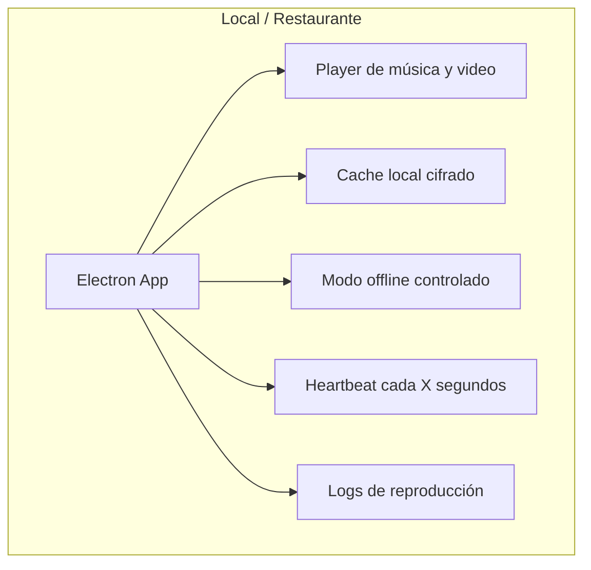
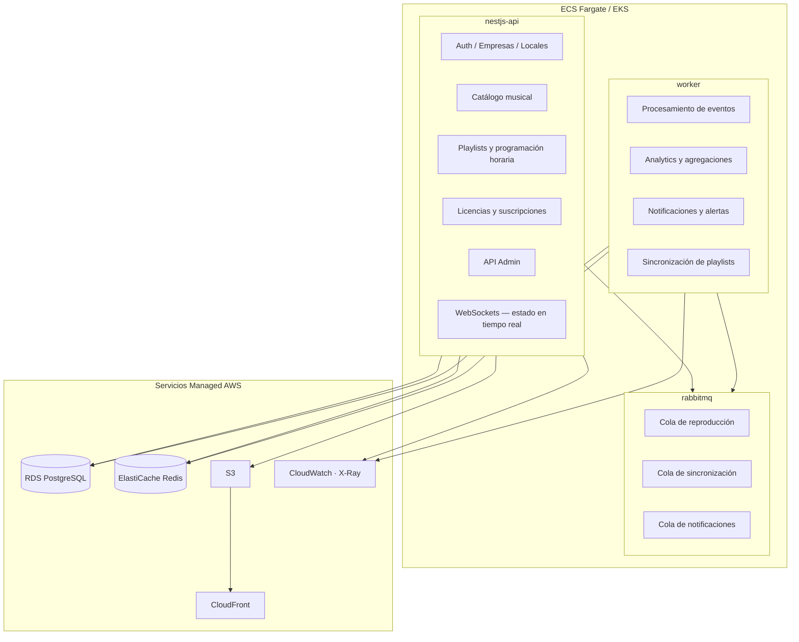
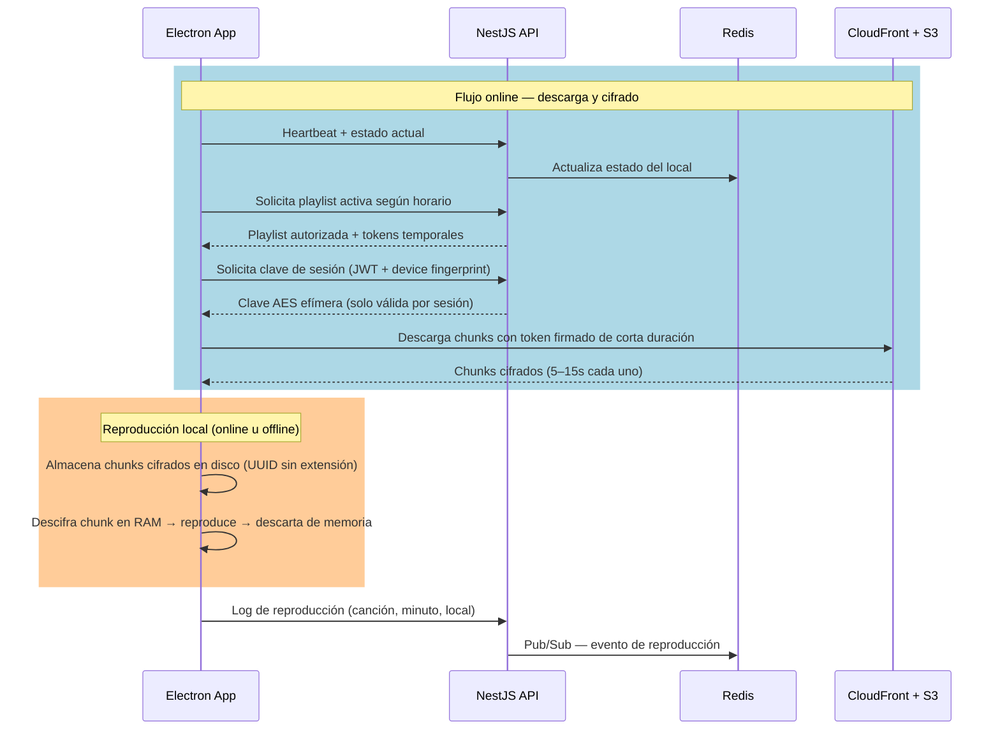
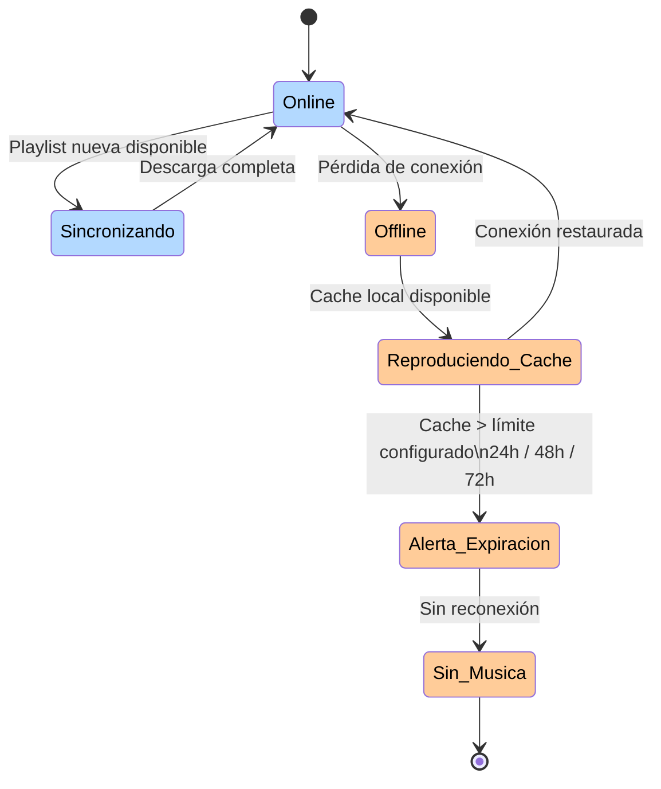
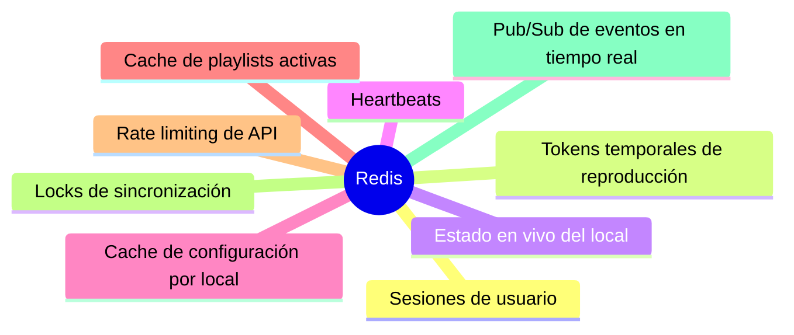
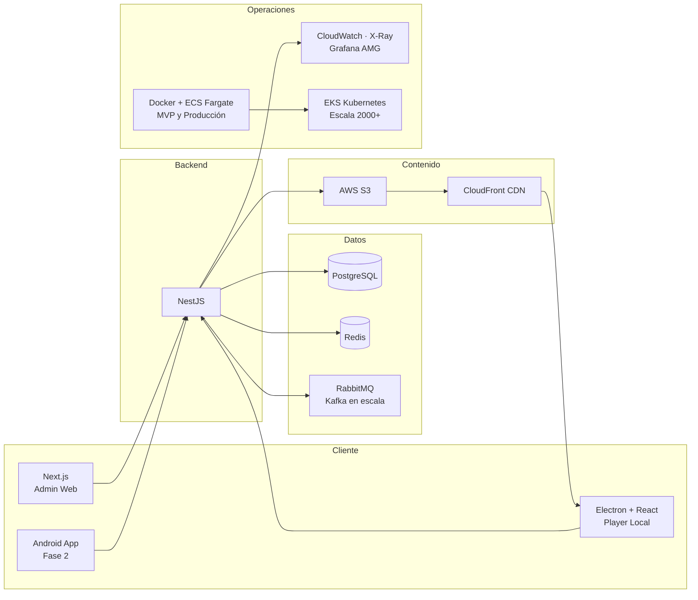
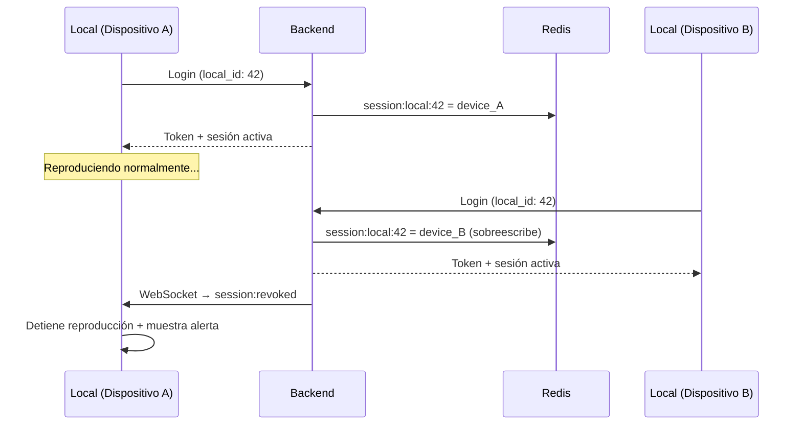
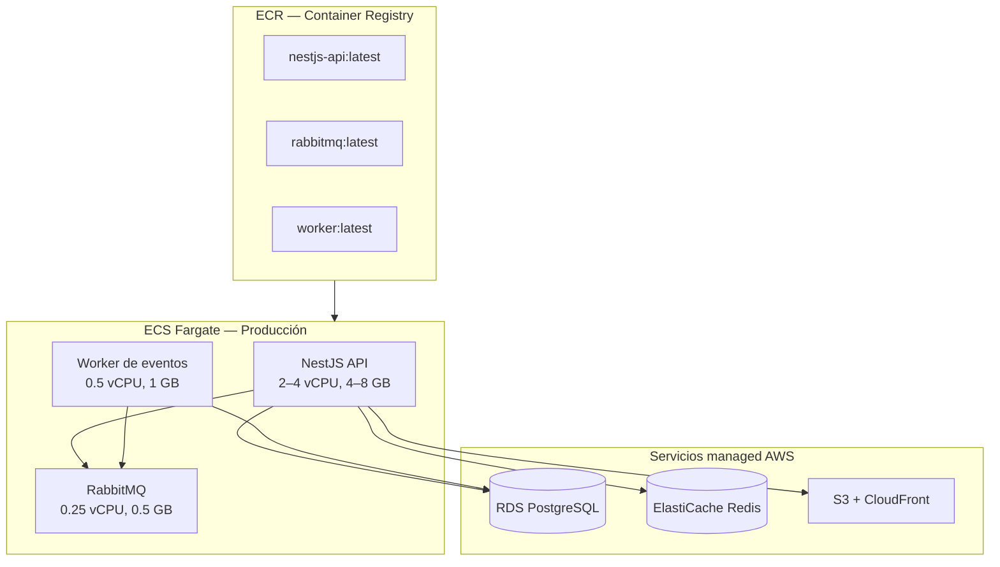
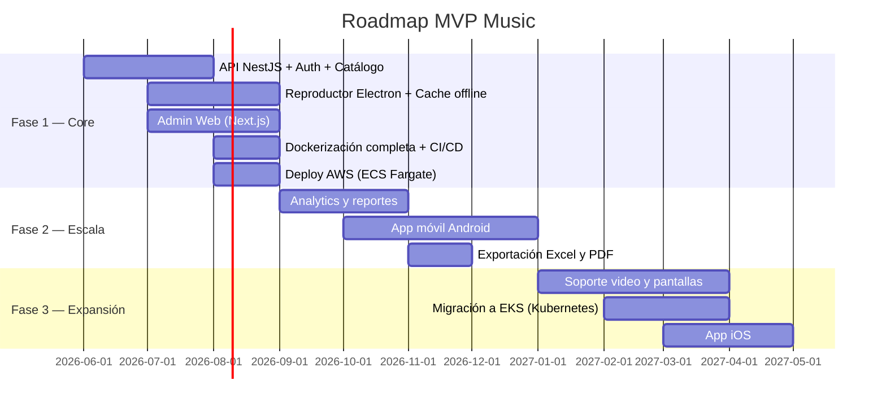

# MVP Music — Plataforma de Streaming Musical B2B para Locales Comerciales

> Modernización de plataforma de streaming musical B2B para locales comerciales, con reproducción resiliente, cache local, monitoreo en tiempo real, analítica de consumo y arquitectura cloud escalable.
>
> **Garantía de servicio:** Ningún local se queda sin música aunque tenga cortes de internet.

---

## 1. Aplicación para locales

La aplicación instalada en cada local se construye con **Electron + React**. Esta decisión cubre restaurantes, hoteles y tiendas con conexión inestable, ya que Electron permite cache local cifrado, control directo del player, logs de reproducción, watchdog y reproducción offline.

---

## 2. Backend

El backend se implementa con **NestJS**, que provee velocidad de desarrollo, soporte nativo para WebSockets, colas de mensajería, APIs REST y un ecosistema Node maduro.

La base de datos principal es **PostgreSQL**. Se usa **Redis** para estado en tiempo real, cache y mensajería ligera. La mensajería asíncrona se gestiona con **RabbitMQ** en etapas iniciales, escalando a **Kafka** si el volumen de eventos lo requiere.

Todo el código propio se dockeriza y corre en **ECS Fargate** (serverless containers). Los servicios de datos se consumen como managed services de AWS.

---

## 3. Entrega de audio — Flujo completo, protección y modo offline

El audio no se sirve directamente desde el backend. Se almacena en **S3** y se entrega a través de **CloudFront**, lo que garantiza baja latencia, alta disponibilidad y escalabilidad. El contenido **nunca llega al local como archivo MP3/AAC completo**: se fragmenta, cifra y almacena como chunks inutilizables sin la clave del backend.

### Flujo de reproducción

### Fragmentación y cifrado local (modelo inspirado en Spotify)

| Capa | Mecanismo |
|------|----------|
| Fragmentación | Cada track se divide en chunks de 5–15 segundos durante la descarga |
| Cifrado por chunk | Cada fragmento se cifra con AES-256-GCM usando una clave derivada por sesión |
| Clave efímera | La clave se obtiene del backend y se almacena **solo en RAM** (nunca en disco) |
| Rotación de claves | Las claves rotan cada vez que el local se reconecta; el cache se re-cifra |
| Sin archivo reconstruible | Los chunks no contienen headers válidos; sin la clave + mapa de fragmentos, el audio es inútil |
| Integridad | Cada chunk incluye un HMAC; si falla validación, se descarta y re-descarga |
| Ofuscación | Archivos en disco con nombres UUID sin extensión, sin metadatos legibles |

### ¿Qué pasa si un usuario intenta extraer el audio?

| Ataque | Mitigación |
|--------|------------|
| Copiar archivos del disco | Solo obtiene blobs cifrados sin headers, inútiles sin clave |
| Interceptar tráfico de red | CDN entrega chunks con token firmado de corta duración; HTTPS obligatorio |
| Dump de memoria RAM | Requiere acceso root; solo expone el chunk actual (5–15s), no el track completo |
| Descompilar Electron (ASAR) | Código ofuscado; la clave nunca está hardcodeada, se obtiene del backend por sesión |
| Grabar salida de audio (loopback) | Fuera del alcance técnico; se mitiga contractualmente |

> **Principio:** El cache local es un buffer de reproducción cifrado, no una biblioteca de archivos. Sin conexión al backend para obtener la clave, el cache expira y se vuelve irrecuperable.

### Modo offline

El límite de reproducción offline es configurable por cliente (24, 48 o 72 horas). Pasado ese límite sin reconexión, el sistema emite una alerta y detiene la reproducción para cumplir con las políticas de licencias. Al reconectar, el backend entrega una nueva clave y el player re-cifra el cache existente.

---

## 4. Usos de Redis

Redis gestiona estado efímero y comunicación en tiempo real. El contenido de audio vive exclusivamente en storage y CDN.

---

## 5. Capacidades del sistema

### En cada local

- Reproducción continua sin cortes.
- Descarga automática de playlists autorizadas.
- Modo offline con límite configurable: 24, 48 o 72 horas.
- Reintento automático de conexión si cae internet.
- Volumen máximo configurable por local desde administración.
- Programación por horario: mañana, tarde y noche con playlists distintas.
- Bloqueo de controles para que el usuario no cambie canciones no autorizadas.
- Reinicio automático del player si el proceso falla (watchdog).
- Alertas automáticas si el local deja de reproducir música.
- Arquitectura preparada para video y pantallas publicitarias.

### En administración

- Estado en tiempo real de locales conectados y desconectados.
- Mapa geográfico por país, ciudad, sede y estado operativo.
- Canción en reproducción ahora mismo en cada local, con minuto exacto.
- Historial completo de reproducción por local.
- Ranking de canciones y playlists más reproducidas.
- Horarios con mayor consumo de streaming.
- Locales con más desconexiones y locales en modo offline.
- Calidad de conexión por local y versión instalada del reproductor.
- Alertas por versión desactualizada del cliente.
- Métrica de cumplimiento: porcentaje del mes con música autorizada reproducida.
- Reportes para sustentar derechos y licencias ante proveedores.
- Exportación a Excel y PDF para clientes corporativos.

### Métricas operativas

| Métrica | Descripción |
|---------|-------------|
| Locales activos ahora | Conexiones activas en tiempo real |
| Locales offline | Con timestamp de última conexión |
| Canciones reproducidas hoy | Total global y por local |
| Horas de música reproducidas | Acumulado diario y mensual |
| Países y ciudades activas | Cobertura geográfica del servicio |
| Top canciones y playlists | Ranking de consumo |
| Locales con más fallas | Para soporte proactivo |
| Promedio de desconexión por ciudad | Indicador de calidad de red por zona |
| Tiempo promedio en modo offline | Indicador de resiliencia |
| Consumo CDN por país | Control de costos de infraestructura |
| Cumplimiento de licencias | Porcentaje de reproducción autorizada |
| Clientes próximos a vencer | Gestión de renovaciones |

---

## 6. Stack tecnológico

---

## 8. Sesiones — Modelo 1:1 por tipo de aplicación

Cada tipo de cliente tiene un modelo de sesión distinto, diseñado para evitar uso compartido de credenciales y proteger el contenido.

### Electron (Player de local)

- **Una sola sesión activa** por credencial de local.
- Si el mismo local inicia sesión en otro dispositivo, la sesión anterior se **invalida inmediatamente** vía WebSocket (`session:revoked`).
- El dispositivo desconectado detiene la reproducción y muestra aviso de "sesión activa en otro equipo".
- Se registra un `device_fingerprint` (MAC + hostname + disco) para detectar cambios de hardware no autorizados.

### Web de administración (Next.js)

- Sesión estándar con JWT + refresh token.
- **Reproducción limitada a preview**: máximo 30–60 segundos por track.
- No permite descarga ni cache de audio.
- Pensada para monitoreo, configuración y reportes, no para consumo musical.
- Múltiples sesiones permitidas por usuario admin (multi-pestaña), pero con rate limiting.

### Diagrama de invalidación

### Resumen por tipo de cliente

| Cliente | Sesiones simultáneas | Audio completo | Cache local | Invalidación |
|---------|---------------------|----------------|-------------|---------------|
| Electron (local) | 1 | ✅ | ✅ Cifrado | Inmediata vía WebSocket |
| Web admin | Múltiples | ❌ Solo preview (30–60s) | ❌ | Por expiración de JWT |
| App móvil (Fase 2) | 1 por local | ✅ | ✅ Cifrado | Misma lógica que Electron |

---

## 9. Costos de infraestructura

Estimación de costos mensuales para distintas escalas de operación. Los precios son referenciales y varían según proveedor y negociación.

### Variables base

| Parámetro | Valor estimado |
|-----------|----------------|
| Tamaño promedio por track (MP3 192kbps) | ~5 MB |
| Tracks reproducidos por local/día | ~120 (8h continuas) |
| Ancho de banda por local/mes (sin cache) | ~18 GB |
| Ancho de banda por local/mes (con cache 80% hit) | ~3.6 GB |
| Catálogo total almacenado | 50,000 tracks ≈ 250 GB |

### Escenario: 100 locales activos

| Servicio | AWS Service | Costo mensual estimado |
|----------|-------------|------------------------|
| Object Storage (250 GB) | S3 Standard | ~$6 |
| CDN / Egress (~360 GB) | CloudFront | ~$32 |
| Backend dockerizado (2 vCPU, 4 GB) | ECS Fargate (1 task) | ~$30–40 |
| Container Registry | ECR | ~$1 |
| PostgreSQL managed | RDS db.t3.micro | ~$15–20 |
| Redis (1 GB) | ElastiCache t3.micro | ~$12 |
| RabbitMQ (dockerizado en Fargate) | ECS Fargate (0.25 vCPU, 0.5 GB) | ~$10 |
| Observabilidad | CloudWatch + X-Ray (free tier) | $0 |
| **Total estimado** | | **~$105–120/mes** |

### Escenario: 500 locales activos

| Servicio | AWS Service | Costo mensual estimado |
|----------|-------------|------------------------|
| Object Storage (250 GB) | S3 Standard | ~$6 |
| CDN / Egress (~1.8 TB) | CloudFront | ~$150 |
| Backend dockerizado (4 vCPU, 8 GB × 2 tasks) | ECS Fargate | ~$120–160 |
| Container Registry | ECR | ~$2 |
| PostgreSQL managed | RDS db.t3.small | ~$30–45 |
| Redis (3 GB) | ElastiCache t3.small | ~$25–35 |
| RabbitMQ managed | Amazon MQ (mq.m5.large) | ~$60 |
| Load Balancer | ALB | ~$20 |
| Observabilidad | CloudWatch + Grafana AMG | ~$30 |
| **Total estimado** | | **~$445–510/mes** |

### Escenario: 2,000 locales activos

| Servicio | AWS Service | Costo mensual estimado |
|----------|-------------|------------------------|
| Object Storage (500 GB) | S3 Standard | ~$12 |
| CDN / Egress (~7.2 TB) | CloudFront (committed pricing) | ~$500–600 |
| Backend dockerizado (Kubernetes) | EKS + Fargate (3 nodos) | ~$300–450 |
| Container Registry | ECR | ~$5 |
| PostgreSQL (HA, réplicas) | RDS db.r6g.large Multi-AZ | ~$200–280 |
| Redis Cluster (6 GB) | ElastiCache r6g.large | ~$80–120 |
| Kafka / Event streaming | Amazon MSK (kafka.m5.large × 3) | ~$400–500 |
| Load Balancer | ALB | ~$25 |
| Observabilidad completa | CloudWatch + Grafana AMG + X-Ray | ~$80–100 |
| **Total estimado** | | **~$1,600–2,080/mes** |

### Nota sobre CloudFront y egress

| Concepto | S3 directo | S3 + CloudFront |
|----------|-----------|------------------|
| Egress (1 TB) | ~$90 | ~$85 (con cache hit ~60%) |
| Egress (5 TB) | ~$450 | ~$340 (committed use discount) |
| Egress (5 TB + cache local 80%) | ~$90 | ~$68 |

El cache cifrado en Electron reduce el egress real entre un **70–90%**, ya que los locales solo descargan tracks nuevos. Con CloudFront Security Savings Bundle se puede reducir un 30% adicional sobre el precio on-demand.

### Arquitectura Docker en AWS

> **Estrategia:** Todo lo que es código propio (API, workers) se dockeriza y corre en ECS Fargate (serverless containers, sin gestionar EC2). Los servicios de datos (PostgreSQL, Redis) se usan managed para evitar overhead operativo. En escala de 2,000+ locales se migra a EKS.

---

## 10. Roadmap de fases

---