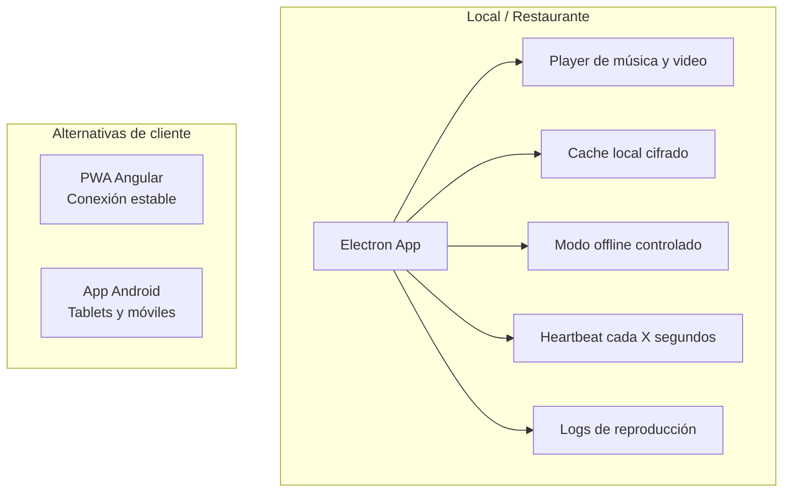
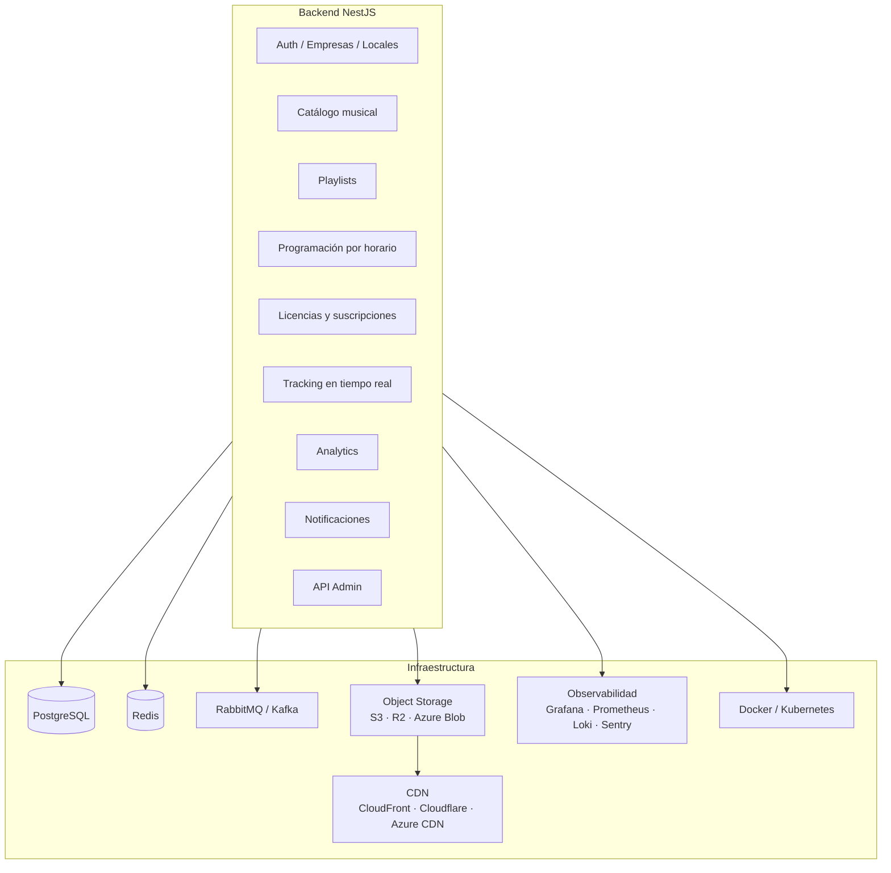
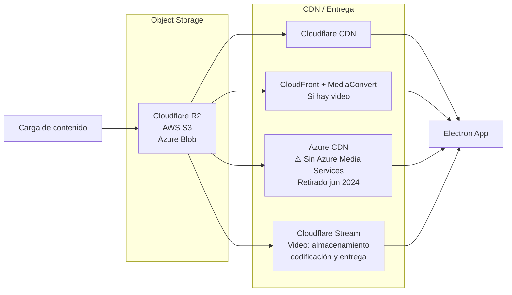
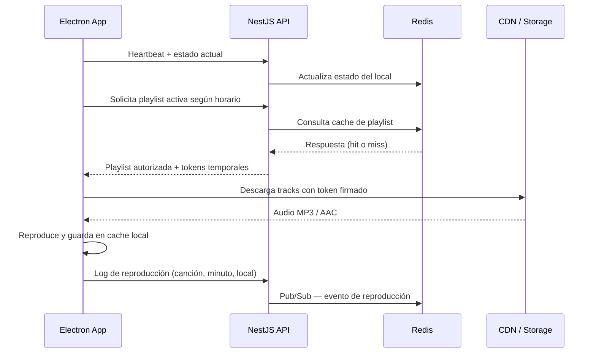
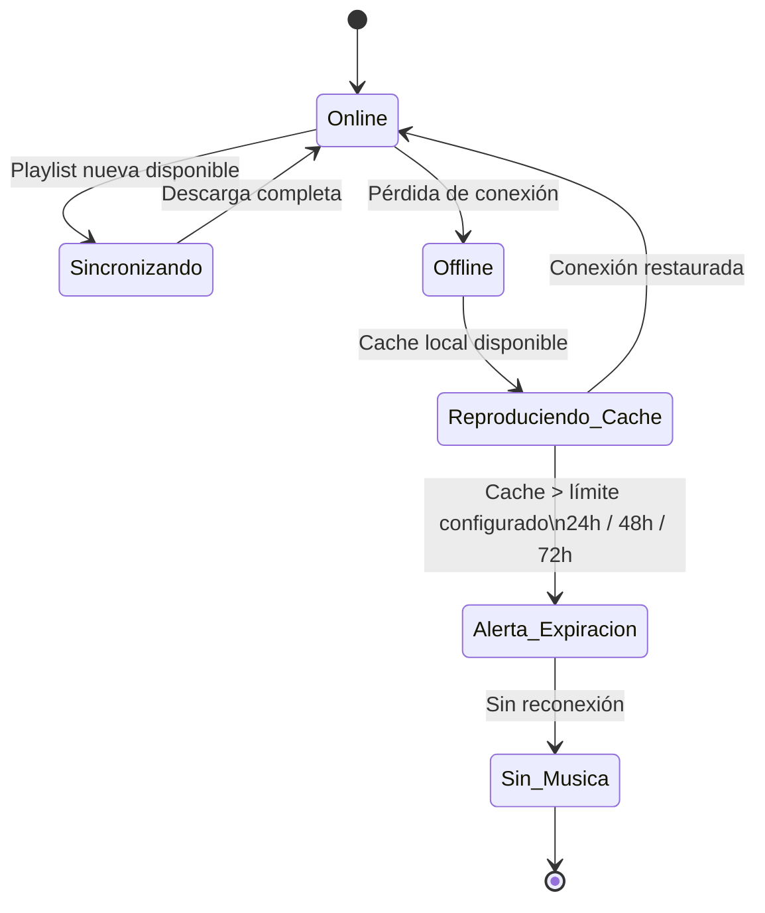
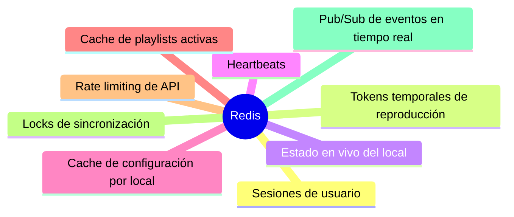
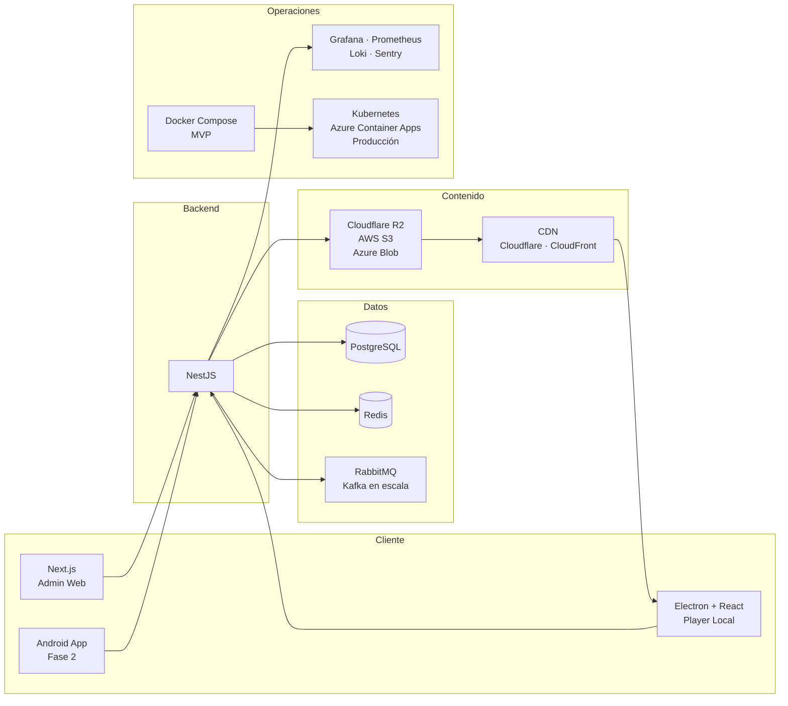
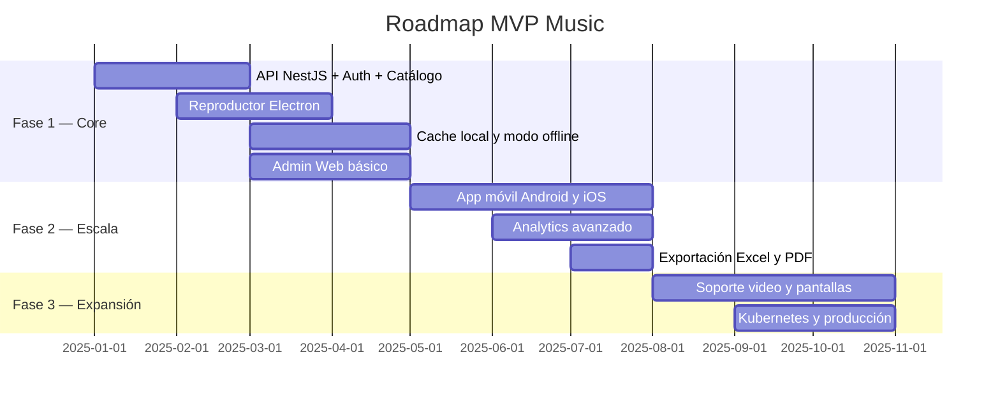

# MVP Music — Plataforma de Streaming Musical B2B para Locales Comerciales

> Modernización de plataforma de streaming musical B2B para locales comerciales, con reproducción resiliente, cache local, monitoreo en tiempo real, analítica de consumo y arquitectura cloud escalable.
>
> **Garantía de servicio:** Ningún local se queda sin música aunque tenga cortes de internet.

---

## 1. Aplicación para locales

La aplicación instalada en cada local se construye con **Electron + React**. Esta decisión cubre restaurantes, hoteles y tiendas con conexión inestable, ya que Electron permite cache local cifrado, control directo del player, logs de reproducción, watchdog y reproducción offline.

Para locales con conectividad estable y sin requerimiento de offline, existe una alternativa como **PWA Angular** ejecutada desde el navegador. Para despliegues en tablets o celulares, se contempla una **app móvil Android** en fases posteriores.

---

## 2. Backend

El backend se implementa con **NestJS**, que provee velocidad de desarrollo, soporte nativo para WebSockets, colas de mensajería, APIs REST y un ecosistema Node maduro.

La base de datos principal es **PostgreSQL**. Se usa **Redis** para estado en tiempo real, cache y mensajería ligera. La mensajería asíncrona se gestiona con **RabbitMQ** en etapas iniciales, escalando a **Kafka** si el volumen de eventos lo requiere.

---

## 3. Entrega de audio

El audio no se sirve directamente desde el backend. Se almacena en **object storage** y se entrega a través de **CDN**, lo que garantiza baja latencia, alta disponibilidad y escalabilidad sin costo de egress innecesario.

> **Nota:** Azure Media Services fue retirado el 30 de junio de 2024. No se debe usar AMS como base de la solución de video.

---

## 4. Flujo de reproducción

---

## 5. Modo offline

El límite de reproducción offline es configurable por cliente (24, 48 o 72 horas). Pasado ese límite sin reconexión, el sistema emite una alerta y detiene la reproducción para cumplir con las políticas de licencias.

---

## 6. Usos de Redis

Redis gestiona estado efímero y comunicación en tiempo real. El contenido de audio vive exclusivamente en storage y CDN.

---

## 7. Capacidades del sistema

### En cada local

- Reproducción continua sin cortes.
- Descarga automática de playlists autorizadas.
- Modo offline con límite configurable: 24, 48 o 72 horas.
- Reintento automático de conexión si cae internet.
- Volumen máximo configurable por local desde administración.
- Programación por horario: mañana, tarde y noche con playlists distintas.
- Bloqueo de controles para que el usuario no cambie canciones no autorizadas.
- Reinicio automático del player si el proceso falla (watchdog).
- Alertas automáticas si el local deja de reproducir música.
- Arquitectura preparada para video y pantallas publicitarias.

### En administración

- Estado en tiempo real de locales conectados y desconectados.
- Mapa geográfico por país, ciudad, sede y estado operativo.
- Canción en reproducción ahora mismo en cada local, con minuto exacto.
- Historial completo de reproducción por local.
- Ranking de canciones y playlists más reproducidas.
- Horarios con mayor consumo de streaming.
- Locales con más desconexiones y locales en modo offline.
- Calidad de conexión por local y versión instalada del reproductor.
- Alertas por versión desactualizada del cliente.
- Métrica de cumplimiento: porcentaje del mes con música autorizada reproducida.
- Reportes para sustentar derechos y licencias ante proveedores.
- Exportación a Excel y PDF para clientes corporativos.

### Métricas operativas

| Métrica | Descripción |
|---------|-------------|
| Locales activos ahora | Conexiones activas en tiempo real |
| Locales offline | Con timestamp de última conexión |
| Canciones reproducidas hoy | Total global y por local |
| Horas de música reproducidas | Acumulado diario y mensual |
| Países y ciudades activas | Cobertura geográfica del servicio |
| Top canciones y playlists | Ranking de consumo |
| Locales con más fallas | Para soporte proactivo |
| Promedio de desconexión por ciudad | Indicador de calidad de red por zona |
| Tiempo promedio en modo offline | Indicador de resiliencia |
| Consumo CDN por país | Control de costos de infraestructura |
| Cumplimiento de licencias | Porcentaje de reproducción autorizada |
| Clientes próximos a vencer | Gestión de renovaciones |

---

## 8. Stack tecnológico

---

## 9. Roadmap de fases

---