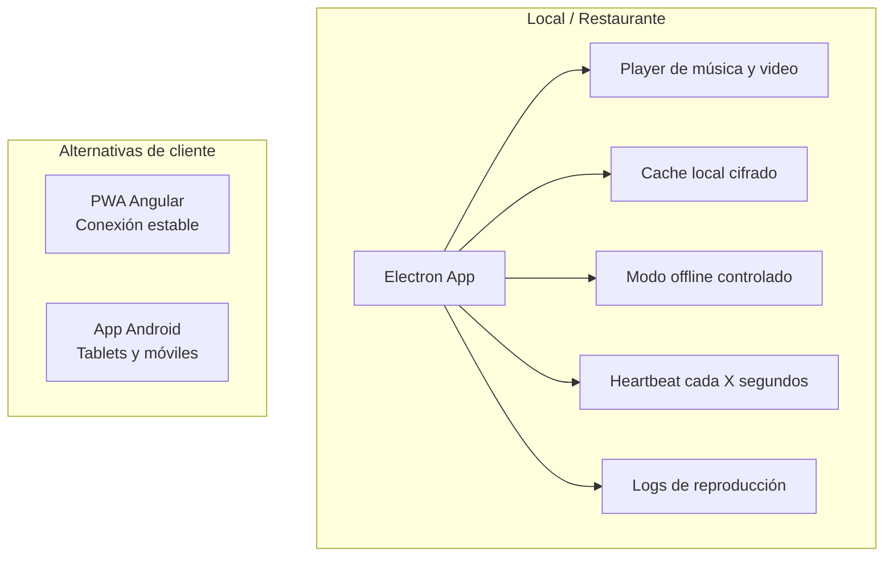
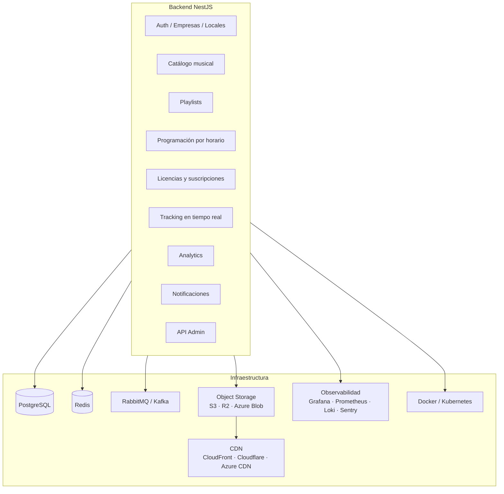
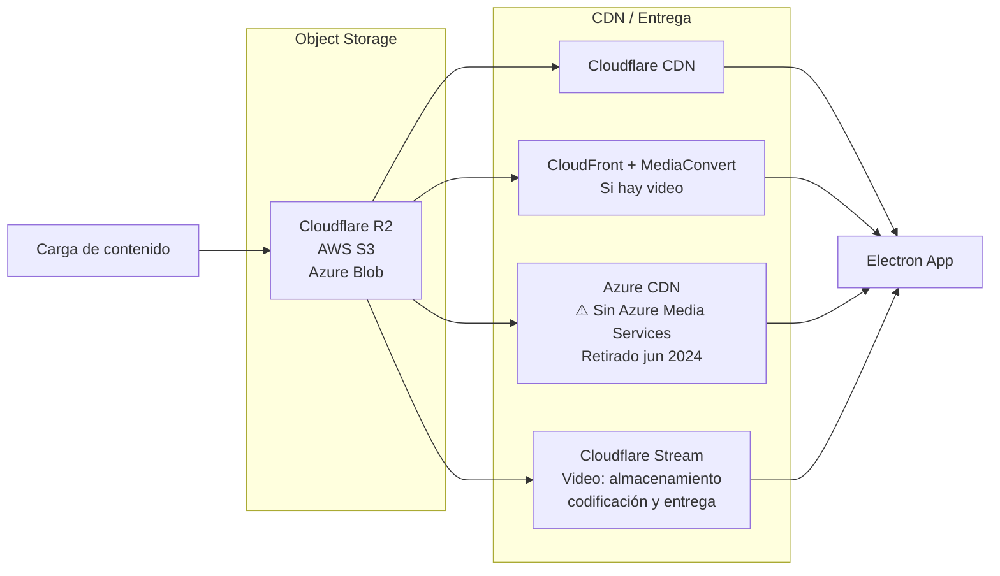
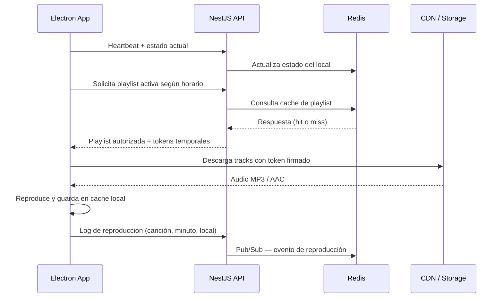
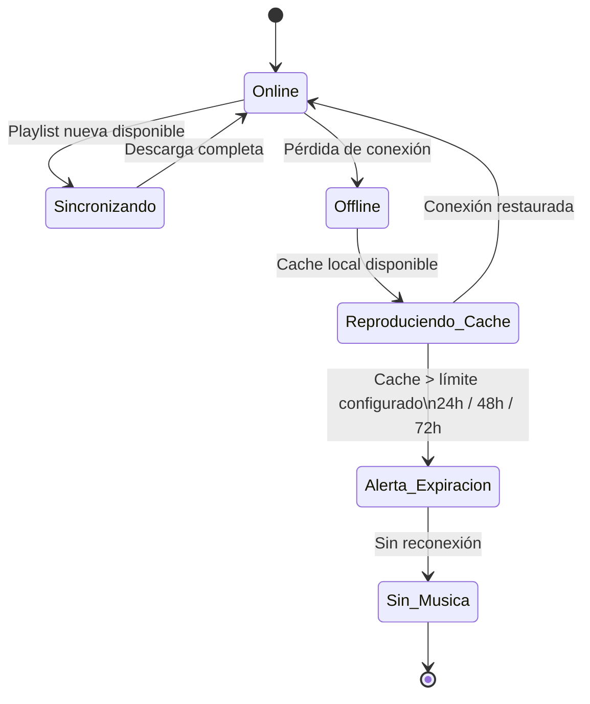
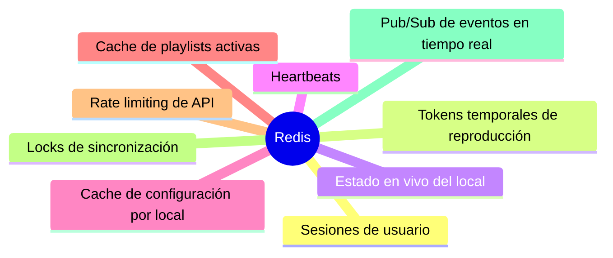
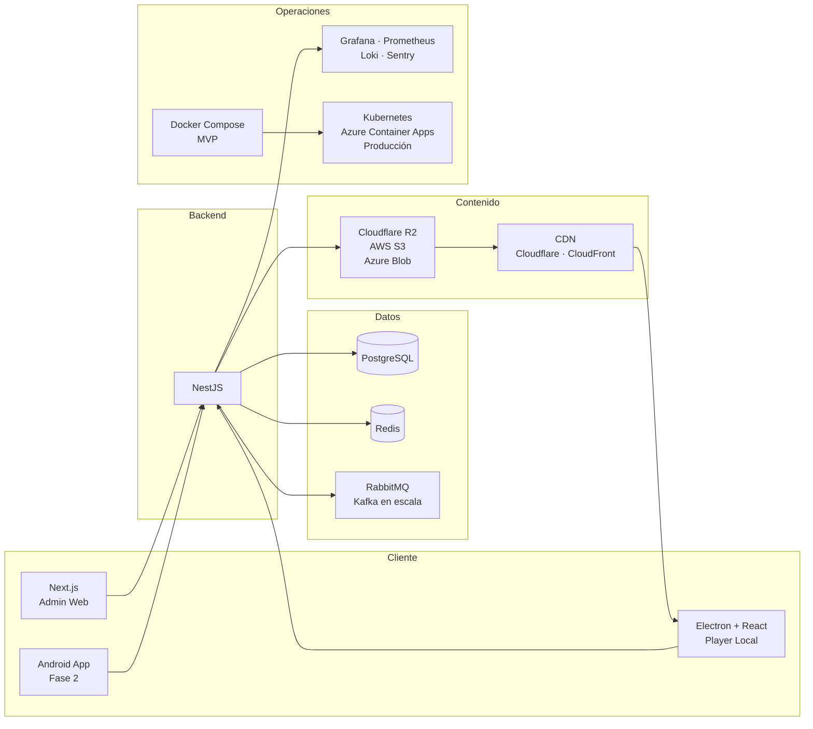
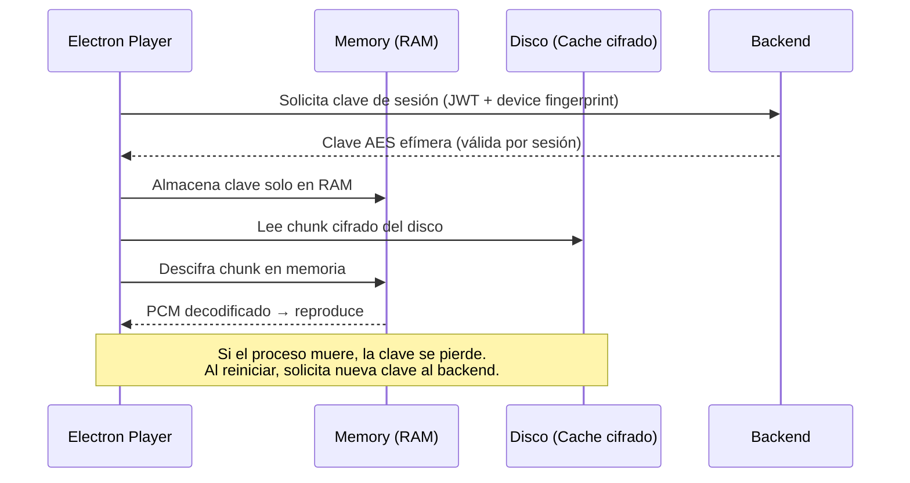
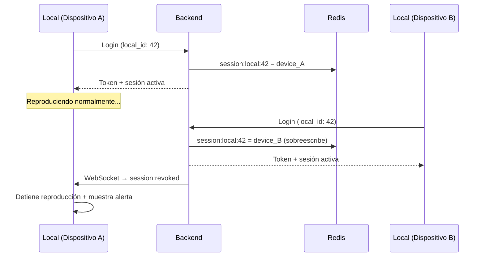
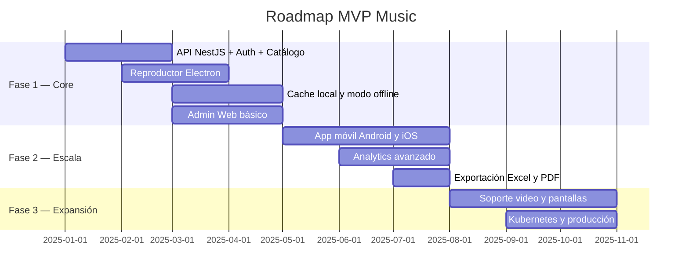

# MVP Music — Plataforma de Streaming Musical B2B para Locales Comerciales

> Modernización de plataforma de streaming musical B2B para locales comerciales, con reproducción resiliente, cache local, monitoreo en tiempo real, analítica de consumo y arquitectura cloud escalable.
>
> **Garantía de servicio:** Ningún local se queda sin música aunque tenga cortes de internet.

---

## 1. Aplicación para locales

La aplicación instalada en cada local se construye con **Electron + React**. Esta decisión cubre restaurantes, hoteles y tiendas con conexión inestable, ya que Electron permite cache local cifrado, control directo del player, logs de reproducción, watchdog y reproducción offline.

Para locales con conectividad estable y sin requerimiento de offline, existe una alternativa como **PWA Angular** ejecutada desde el navegador. Para despliegues en tablets o celulares, se contempla una **app móvil Android** en fases posteriores.

---

## 2. Backend

El backend se implementa con **NestJS**, que provee velocidad de desarrollo, soporte nativo para WebSockets, colas de mensajería, APIs REST y un ecosistema Node maduro.

La base de datos principal es **PostgreSQL**. Se usa **Redis** para estado en tiempo real, cache y mensajería ligera. La mensajería asíncrona se gestiona con **RabbitMQ** en etapas iniciales, escalando a **Kafka** si el volumen de eventos lo requiere.

---

## 3. Entrega de audio

El audio no se sirve directamente desde el backend. Se almacena en **object storage** y se entrega a través de **CDN**, lo que garantiza baja latencia, alta disponibilidad y escalabilidad sin costo de egress innecesario.

> **Nota:** Azure Media Services fue retirado el 30 de junio de 2024. No se debe usar AMS como base de la solución de video.

---

## 4. Flujo de reproducción

---

## 5. Modo offline

El límite de reproducción offline es configurable por cliente (24, 48 o 72 horas). Pasado ese límite sin reconexión, el sistema emite una alerta y detiene la reproducción para cumplir con las políticas de licencias.

---

## 6. Usos de Redis

Redis gestiona estado efímero y comunicación en tiempo real. El contenido de audio vive exclusivamente en storage y CDN.

---

## 7. Capacidades del sistema

### En cada local

- Reproducción continua sin cortes.
- Descarga automática de playlists autorizadas.
- Modo offline con límite configurable: 24, 48 o 72 horas.
- Reintento automático de conexión si cae internet.
- Volumen máximo configurable por local desde administración.
- Programación por horario: mañana, tarde y noche con playlists distintas.
- Bloqueo de controles para que el usuario no cambie canciones no autorizadas.
- Reinicio automático del player si el proceso falla (watchdog).
- Alertas automáticas si el local deja de reproducir música.
- Arquitectura preparada para video y pantallas publicitarias.

### En administración

- Estado en tiempo real de locales conectados y desconectados.
- Mapa geográfico por país, ciudad, sede y estado operativo.
- Canción en reproducción ahora mismo en cada local, con minuto exacto.
- Historial completo de reproducción por local.
- Ranking de canciones y playlists más reproducidas.
- Horarios con mayor consumo de streaming.
- Locales con más desconexiones y locales en modo offline.
- Calidad de conexión por local y versión instalada del reproductor.
- Alertas por versión desactualizada del cliente.
- Métrica de cumplimiento: porcentaje del mes con música autorizada reproducida.
- Reportes para sustentar derechos y licencias ante proveedores.
- Exportación a Excel y PDF para clientes corporativos.

### Métricas operativas

| Métrica | Descripción |
|---------|-------------|
| Locales activos ahora | Conexiones activas en tiempo real |
| Locales offline | Con timestamp de última conexión |
| Canciones reproducidas hoy | Total global y por local |
| Horas de música reproducidas | Acumulado diario y mensual |
| Países y ciudades activas | Cobertura geográfica del servicio |
| Top canciones y playlists | Ranking de consumo |
| Locales con más fallas | Para soporte proactivo |
| Promedio de desconexión por ciudad | Indicador de calidad de red por zona |
| Tiempo promedio en modo offline | Indicador de resiliencia |
| Consumo CDN por país | Control de costos de infraestructura |
| Cumplimiento de licencias | Porcentaje de reproducción autorizada |
| Clientes próximos a vencer | Gestión de renovaciones |

---

## 8. Stack tecnológico

---

## 9. Protección de audio — Fragmentación y cifrado local

El audio almacenado en cache local **nunca se guarda como archivos MP3/AAC completos**. Se aplica un esquema de fragmentación y cifrado inspirado en el modelo de Spotify (OGG fragmentado con claves efímeras), adaptado al contexto B2B.

### Estrategia técnica

| Capa | Mecanismo |
|------|----------|
| Fragmentación | Cada track se divide en chunks de 5–15 segundos durante la descarga |
| Cifrado por chunk | Cada fragmento se cifra con AES-256-GCM usando una clave derivada por sesión |
| Clave efímera | La clave de descifrado se obtiene del backend y se almacena solo en memoria (nunca en disco) |
| Rotación de claves | Las claves rotan cada vez que el local se reconecta; el cache se re-cifra con la nueva clave |
| Sin archivo reconstruible | Los chunks no contienen headers válidos de MP3/AAC; sin la clave + el mapa de fragmentos, el audio es inútil |
| Integridad | Cada chunk incluye un HMAC que el player valida antes de reproducir; si falla, se descarta y re-descarga |
| Ofuscación de storage | Los archivos en disco usan nombres UUID sin extensión, sin metadatos legibles |

### Flujo de reproducción segura

### ¿Qué pasa si un usuario intenta extraer el audio?

| Ataque | Mitigación |
|--------|------------|
| Copiar archivos del disco | Solo obtiene blobs cifrados sin headers, inútiles sin clave |
| Interceptar tráfico de red | CDN entrega chunks con token firmado de corta duración; HTTPS obligatorio |
| Dump de memoria RAM | Requiere acceso root; solo expone el chunk actual (5–15s), no el track completo |
| Descompilar Electron (ASAR) | El código se ofusca y la clave nunca está hardcodeada; se obtiene del backend por sesión |
| Grabar salida de audio (loopback) | Fuera del alcance técnico; se mitiga contractualmente en los términos de servicio |

> **Principio:** El cache local es un buffer de reproducción cifrado, no una biblioteca de archivos. Sin conexión al backend para obtener la clave, el cache expira y se vuelve irrecuperable.

---

## 10. Sesiones — Modelo 1:1 por tipo de aplicación

Cada tipo de cliente tiene un modelo de sesión distinto, diseñado para evitar uso compartido de credenciales y proteger el contenido.

### Electron (Player de local)

- **Una sola sesión activa** por credencial de local.
- Si el mismo local inicia sesión en otro dispositivo, la sesión anterior se **invalida inmediatamente** vía WebSocket (`session:revoked`).
- El dispositivo desconectado detiene la reproducción y muestra aviso de "sesión activa en otro equipo".
- Se registra un `device_fingerprint` (MAC + hostname + disco) para detectar cambios de hardware no autorizados.

### Web de administración (Next.js)

- Sesión estándar con JWT + refresh token.
- **Reproducción limitada a preview**: máximo 30–60 segundos por track.
- No permite descarga ni cache de audio.
- Pensada para monitoreo, configuración y reportes, no para consumo musical.
- Múltiples sesiones permitidas por usuario admin (multi-pestaña), pero con rate limiting.

### Diagrama de invalidación

### Resumen por tipo de cliente

| Cliente | Sesiones simultáneas | Audio completo | Cache local | Invalidación |
|---------|---------------------|----------------|-------------|---------------|
| Electron (local) | 1 | ✅ | ✅ Cifrado | Inmediata vía WebSocket |
| Web admin | Múltiples | ❌ Solo preview (30–60s) | ❌ | Por expiración de JWT |
| App móvil (Fase 2) | 1 por local | ✅ | ✅ Cifrado | Misma lógica que Electron |

---

## 11. Costos de infraestructura

Estimación de costos mensuales para distintas escalas de operación. Los precios son referenciales y varían según proveedor y negociación.

### Variables base

| Parámetro | Valor estimado |
|-----------|----------------|
| Tamaño promedio por track (MP3 192kbps) | ~5 MB |
| Tracks reproducidos por local/día | ~120 (8h continuas) |
| Ancho de banda por local/mes (sin cache) | ~18 GB |
| Ancho de banda por local/mes (con cache 80% hit) | ~3.6 GB |
| Catálogo total almacenado | 50,000 tracks ≈ 250 GB |

### Escenario: 100 locales activos

| Servicio | Proveedor | Costo mensual estimado |
|----------|-----------|------------------------|
| Object Storage (250 GB) | Cloudflare R2 | ~$4 (sin egress) |
| CDN / Egress (~360 GB) | Cloudflare (incluido en R2) | $0 |
| Servidor backend (2 vCPU, 4 GB) | AWS EC2 t3.medium / Azure B2s | ~$30–40 |
| PostgreSQL managed (básico) | AWS RDS db.t3.micro / Azure Flexible | ~$15–25 |
| Redis (cache, 1 GB) | AWS ElastiCache t3.micro / Upstash | ~$10–15 |
| RabbitMQ | Self-hosted en mismo servidor | $0 (incluido) |
| Observabilidad | Grafana Cloud Free + Sentry Free | $0 |
| **Total estimado** | | **~$60–85/mes** |

### Escenario: 500 locales activos

| Servicio | Proveedor | Costo mensual estimado |
|----------|-----------|------------------------|
| Object Storage (250 GB) | Cloudflare R2 | ~$4 |
| CDN / Egress (~1.8 TB) | Cloudflare (incluido) | $0 |
| Backend (4 vCPU, 8 GB + réplica) | AWS EC2 t3.large × 2 | ~$120–160 |
| PostgreSQL managed | AWS RDS db.t3.small | ~$30–50 |
| Redis (3 GB) | AWS ElastiCache t3.small | ~$25–40 |
| RabbitMQ managed | Amazon MQ (mq.m5.large) | ~$60 |
| Observabilidad | Grafana Cloud Pro | ~$30 |
| **Total estimado** | | **~$270–345/mes** |

### Escenario: 2,000 locales activos

| Servicio | Proveedor | Costo mensual estimado |
|----------|-----------|------------------------|
| Object Storage (500 GB) | Cloudflare R2 | ~$8 |
| CDN / Egress (~7.2 TB) | Cloudflare (incluido) | $0 |
| Backend (Kubernetes, 3 nodos) | Azure AKS / AWS EKS | ~$300–450 |
| PostgreSQL (HA, réplicas) | AWS RDS db.r6g.large | ~$150–200 |
| Redis Cluster (6 GB) | AWS ElastiCache r6g.large | ~$80–120 |
| Kafka / Event streaming | Amazon MSK (kafka.m5.large × 3) | ~$400–500 |
| Observabilidad completa | Grafana Cloud + Sentry Team | ~$80–100 |
| **Total estimado** | | **~$1,020–1,380/mes** |

### ¿Por qué Cloudflare R2 como opción principal de storage?

| Concepto | AWS S3 | Cloudflare R2 |
|----------|--------|---------------|
| Almacenamiento (250 GB) | ~$5.75 | ~$3.75 |
| Egress (1 TB) | ~$90 | **$0** |
| Egress (5 TB) | ~$450 | **$0** |

Para una plataforma de streaming donde el egress es el costo dominante, R2 reduce drásticamente la factura. Si se requiere AWS por compliance, se puede usar **S3 + CloudFront** con pricing comprometido.

### Nota sobre el impacto del cache local

El cache cifrado en Electron reduce el egress real entre un **70–90%**, ya que los locales solo descargan tracks nuevos. Esto significa que los costos de CDN/egress en la tabla ya contemplan el peor caso; en operación real serán significativamente menores.

---

## 12. Roadmap de fases

---